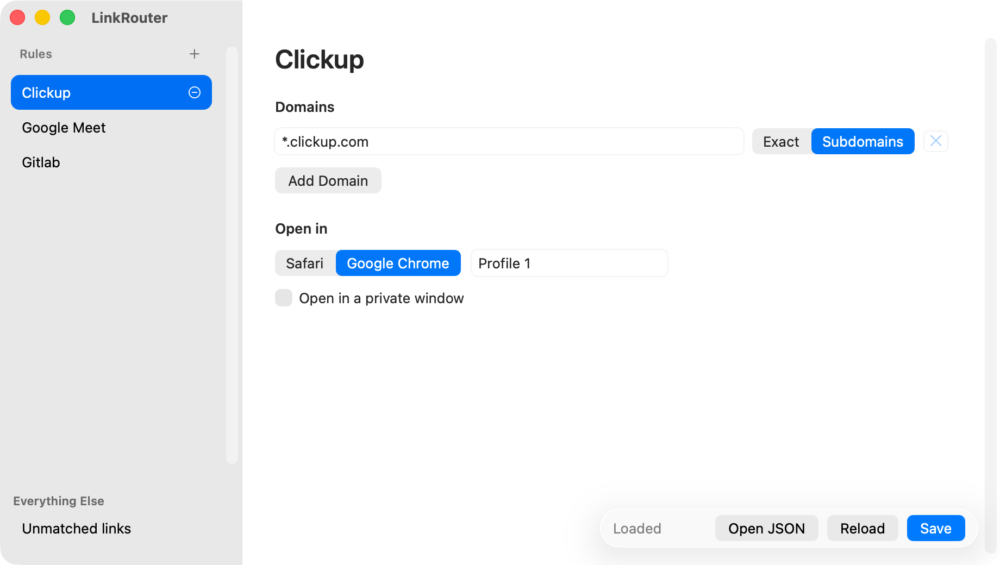

# LinkRouter

LinkRouter is a small macOS menu-bar app that sends web links to Safari or to a specific Google Chrome profile. Its ordered rules live in a readable JSON file, and the included graphical settings editor writes that file for you.



It follows the shape of the utility shown in [Thorsten Ball's LinkRouter post](https://x.com/thorstenball/status/2098327328845656224): first-match host rules, an explicit fallback, and Chrome profile routing.

## Requirements

- macOS 13 or newer
- Apple Command Line Tools (`xcode-select --install` if they are not already installed)
- Safari and/or the standard Google Chrome app (`com.google.Chrome`)

LinkRouter has no third-party dependencies and does not require the full Xcode app.

## Install

Build the installer, open it, and drag LinkRouter to **Applications**:

```sh
make installer
open dist/LinkRouter-0.2.0.dmg
```

The disk image contains `LinkRouter.app` and an **Applications** shortcut. The app uses the same original routing-fork mark in the menu bar and in its high-resolution Finder icon.

The local build is ad-hoc signed and intended for this Mac. Distribution to other Macs requires signing with a Developer ID certificate and notarization.

## Build and run from the repository

```sh
make verify
open dist/LinkRouter.app
```

`make verify` runs the automated tests, builds a native app bundle at `dist/LinkRouter.app`, validates its property list and icon, and verifies its ad-hoc signature. `make verify-installer` additionally builds, mounts, and inspects the disk image.

To keep the app somewhere permanent, quit it and copy `dist/LinkRouter.app` to `/Applications` before opening it again. Moving it after selecting it as the default browser may make macOS point at the old location.

Opening LinkRouter directly presents the rule editor. After closing that window, the app continues running from its branching-arrow menu-bar icon so it can route links. Opening the app again brings the editor back.

To have LinkRouter available automatically, open its menu and enable **Start at Login**. The checkmark follows the current macOS Login Items state; if approval is required, LinkRouter opens the relevant System Settings pane. Login launches are silent, so only the menu-bar icon appears—the rule editor still opens for an ordinary app launch.

## Configure routing

1. Click LinkRouter's branching-arrow icon in the menu bar.
2. Choose **Configure Rules…**.
3. Select **Unmatched links** in the sidebar and choose the fallback browser.
4. Use **+** beside **Rules** to add a rule, then edit its name, domains, exact/subdomain matching mode, browser, and optional Chrome profile.
5. Drag rule rows into priority order. Select a rule to reveal its circled minus; hover over the minus to reveal **Delete**. Untouched new rules are removed without confirmation; configured or saved rules still ask for confirmation.
6. Enable **Open in a private window** when a Chrome target should open in an Incognito window.
7. Choose **Save**. New links use the saved rules immediately.

An exact pattern such as `console.cloud.google.com` matches only that host. A leading wildcard such as `*.example.com` matches both `example.com` and any subdomain such as `docs.example.com`. Matching is case-insensitive. This first version intentionally matches hosts, not URL paths or query parameters.

For Chrome, enter the profile directory—not necessarily the visible profile name. Open `chrome://version` in that profile and use the final component of **Profile Path**, typically `Default`, `Profile 1`, or `Profile 2`. Leave the field empty to let Chrome choose normally.

Private windows are supported for Google Chrome through its Incognito launch mode and can be combined with a profile. Safari targets intentionally disable this option because Safari has no supported API for opening a URL in a guaranteed private window.

## Make LinkRouter the default browser

Launch the packaged app, open its menu, and choose **Set as Default Browser…**. LinkRouter asks macOS to associate `http` and `https`; macOS may show consent prompts. The app never changes defaults automatically.

Version 0.2.0 no longer registers for `file://` URLs or HTML documents. When upgrading from 0.1.x, replace the older copy in `/Applications` before testing local HTML workflows. If macOS still opens HTML files with LinkRouter afterward, select an HTML file in Finder, choose **Get Info**, select the intended browser under **Open with**, and choose **Change All**.

The app must stay running to route links. It has no Dock icon; quit it from **Quit LinkRouter** in the menu.

## Config file

The editor reads and writes:

```text
~/Library/Application Support/LinkRouter/config.json
```

You can also use **Open JSON** in the settings window, edit the file directly, and then choose **Reload** in that same window. The format is demonstrated in [Examples/config.json](Examples/config.json):

```json
{
  "default": { "app": "Safari" },
  "rules": [
    {
      "name": "Work",
      "hosts": ["*.example.com"],
      "app": "Google Chrome",
      "profile": "Profile 1",
      "private": true
    }
  ]
}
```

Supported `app` values are exactly `Safari` and `Google Chrome`. A Chrome `profile` and Boolean `private` setting are optional; omitted `private` values default to `false`. Invalid JSON is reported in the menu and is never overwritten; LinkRouter temporarily falls back to Safari until the file is fixed and reloaded.

## Privacy and safety

- All routing and configuration stay on the Mac.
- The settings UI is built entirely with native AppKit controls; LinkRouter has no embedded web content, telemetry, analytics, or browsing-history log.
- Only `http` and `https` URLs are accepted.
- Browser names, host patterns, and Chrome profile directories are validated.
- Chrome is launched with a fixed executable and a typed argument array; config values never pass through a shell.
- Config saves are atomic and use user-only file permissions.
- The editor refuses to replace a malformed existing file, and reading and writing share a 1 MB size limit.

## Developer commands

```sh
make test           # compile and run all automated tests
make build          # compile the native executable
make app            # assemble and ad-hoc-sign dist/LinkRouter.app
make installer      # create dist/LinkRouter-0.2.0.dmg
make verify-bundle  # validate URL schemes, agent-app setting, and signature
make verify-installer # build, mount, and inspect the installer
make run            # build and launch the app
make clean          # remove only local build outputs
```

## Platform references

The implementation follows Apple's documented APIs and bundle keys:

- [`NSApplicationDelegate.application(_:open:)`](https://developer.apple.com/documentation/appkit/nsapplicationdelegate/application(_:open:)) delivers declared URL types to the app.
- [`NSWorkspace.open(_:withApplicationAt:configuration:completionHandler:)`](https://developer.apple.com/documentation/appkit/nsworkspace/open(_:withapplicationat:configuration:completionhandler:)) opens a URL in an explicitly selected app.
- [`NSWorkspace.setDefaultApplication(at:toOpenURLsWithScheme:completion:)`](https://developer.apple.com/documentation/appkit/nsworkspace/setdefaultapplication(at:toopenurlswithscheme:completion:)) requests the default handler and allows macOS to obtain consent.
- [`CFBundleURLTypes`](https://developer.apple.com/documentation/bundleresources/information-property-list/cfbundleurltypes) declares `http` and `https` support.
- [`CFBundleIconFile`](https://developer.apple.com/documentation/bundleresources/information-property-list/cfbundleiconfile) identifies the icon in the app bundle's resources.
- [`LSUIElement`](https://developer.apple.com/documentation/bundleresources/information-property-list/lsuielement) keeps this agent app out of the Dock.
- [`SMAppService.mainAppService`](https://developer.apple.com/documentation/servicemanagement/smappservice/mainapp?language=objc) registers the main app to launch at login and exposes its current approval state.
- [`NSSplitViewController`](https://developer.apple.com/documentation/appkit/nssplitviewcontroller) provides the native sidebar and continuously resizable rule editor.
- [`NSGlassEffectView`](https://developer.apple.com/documentation/appkit/nsglasseffectview) provides the Liquid Glass action surface on macOS 26 and newer.
- [`NSVisualEffectView`](https://developer.apple.com/documentation/appkit/nsvisualeffectview) provides a semantic native-material fallback on macOS 13 through 15.
- [Launch Apple Event constants](https://developer.apple.com/documentation/coreservices/apple_events/1556410-launch_apple_event_constants) identify login-item launches so the editor can remain closed.
- [Chromium's `kIncognito` switch](https://chromium.googlesource.com/chromium/src/+/refs/heads/main/chrome/common/chrome_switches.cc) launches Chrome directly in Incognito mode.
